# TEMP — Jawaban Pertanyaan Project Owner

> **FILE SEMENTARA — BUKAN BASELINE / BUKAN ACUAN IMPLEMENTASI**
>
> File ini menampung hasil diskusi pertanyaan Project Owner satu per satu. Setiap
> keputusan yang disetujui tetap harus dipindahkan ke baseline dan/atau ADR yang
> relevan sebelum diimplementasikan.

---

## 1. Deployment Landing Page dan Aplikasi dengan Subdomain di Railway

### Pertanyaan

Bagaimana deployment landing page dan aplikasi dibuat terpisah seperti:

```text
buffer.com
publish.buffer.com
```

### Rekomendasi

Gunakan pola domain berikut:

```text
domain.com          → landing / marketing website
publish.domain.com  → aplikasi utama
```

Untuk MVP, kedua domain tersebut tetap dilayani oleh:

- satu aplikasi Next.js: `apps/web`;
- satu Railway `web` service; dan
- satu deployment unit.

Dua domain tidak otomatis membutuhkan dua aplikasi atau dua deployment.
Railway dapat memasang beberapa custom domain pada service yang sama, lalu
Next.js membedakan area marketing dan produk berdasarkan hostname request.

```text
                    ┌─ domain.com
Internet → Railway web service
                    └─ publish.domain.com
```

### Tanggung Jawab Setiap Domain

#### `domain.com`

Area publik dan marketing:

- Landing page
- Features
- Pricing
- About
- Terms dan Privacy
- CTA Login/Register menuju `publish.domain.com`

Contoh:

```text
https://domain.com/
https://domain.com/features
https://domain.com/pricing
```

#### `publish.domain.com`

Area produk:

- Login dan register
- Onboarding
- Workspace
- Publishing
- Engagement
- Analytics
- Settings
- Better Auth endpoint
- Outstand webhook
- Internal job endpoint

Contoh:

```text
https://publish.domain.com/login
https://publish.domain.com/acme/home
https://publish.domain.com/acme/publish/calendar
```

Workspace tetap menggunakan path slug:

```text
publish.domain.com/[workspace-slug]/...
```

Workspace tidak menggunakan subdomain tersendiri seperti:

```text
[workspace-slug].domain.com
```

### Hostname-Based Routing

Root route saat ini mengarahkan user ke workspace aktif atau onboarding. Dengan
landing page, perilakunya dibedakan berdasarkan hostname:

```text
Host: domain.com
/ → landing page

Host: publish.domain.com
/ → workspace aktif atau onboarding
```

Alur konseptual:

```text
Request
  ↓
Next.js Middleware membaca hostname
  ├─ domain.com
  │    └─ route marketing
  └─ publish.domain.com
       └─ route aplikasi
```

### Konfigurasi Railway dan DNS

Tambahkan dua custom domain pada Railway `web` service yang sama:

1. `domain.com`
2. `publish.domain.com`

Railway memberikan record routing dan verifikasi untuk setiap domain:

- root domain menggunakan CNAME flattening, ALIAS, atau ANAME sesuai DNS
  provider;
- subdomain `publish` menggunakan CNAME biasa; dan
- keduanya membutuhkan record TXT verifikasi dari Railway.

Railway menerbitkan dan memperbarui sertifikat HTTPS/TLS secara otomatis setelah
DNS terverifikasi.

Rekomendasi domain staging:

```text
staging.domain.com          → landing staging
publish-staging.domain.com  → aplikasi staging
```

### Auth, Cookie, dan Webhook

Better Auth ditempatkan pada subdomain aplikasi:

```text
BETTER_AUTH_URL=https://publish.domain.com
```

Google OAuth callback:

```text
https://publish.domain.com/api/auth/callback/google
```

Session cookie sebaiknya host-only untuk `publish.domain.com`. Landing page tidak
perlu membaca session aplikasi. CTA Login/Register pada landing page cukup
mengarahkan pengguna ke subdomain aplikasi.

Outstand webhook:

```text
https://publish.domain.com/api/webhooks/outstand
```

### SEO

- `domain.com` boleh diindeks search engine.
- `publish.domain.com` menggunakan `noindex`.
- Sitemap dan metadata marketing hanya diterbitkan untuk domain utama.
- Login, workspace, dan dashboard tidak masuk hasil pencarian.

### Alasan Tetap Satu Deployment pada MVP

- Tidak menambah service dan biaya Railway.
- Tidak menggandakan konfigurasi build dan environment variables.
- Tetap menggunakan satu codebase dan satu pipeline.
- Landing dan aplikasi terlihat terpisah bagi pengguna.
- Selaras dengan baseline saat ini yang menetapkan `apps/web` sebagai
  satu-satunya aplikasi MVP.
- Dapat dipisahkan kemudian tanpa mengubah pengalaman domain publik.

Pola domain Buffer tidak membuktikan bahwa landing dan aplikasinya menggunakan
deployment terpisah. Project dapat meniru batas pengalaman pengguna tersebut
tanpa meniru kompleksitas infrastrukturnya.

### Kapan Perlu Dua Aplikasi dan Dua Deployment?

Pertimbangkan pemisahan berikut:

```text
apps/marketing → Railway marketing service
apps/web       → Railway product service
```

hanya jika:

- landing dan produk memiliki jadwal rilis berbeda;
- marketing site menggunakan teknologi berbeda;
- traffic landing membutuhkan scaling independen;
- performa/SEO landing terganggu oleh aplikasi utama; atau
- ada tim yang mengelola marketing site secara terpisah.

Kondisi tersebut belum ada pada MVP saat ini.

### Dampak terhadap Baseline

Keputusan ini bersifat material karena:

- landing page belum didefinisikan dalam routing MVP;
- root `/` saat ini melakukan redirect ke workspace/onboarding;
- deployment baseline baru menetapkan satu custom domain production;
- konfigurasi auth, OAuth callback, cookie, SEO, dan webhook ikut terdampak.

Jika disetujui, keputusan final perlu dicatat melalui ADR dan diselaraskan ke:

- Product/UX untuk scope landing page;
- routing dan Middleware;
- Engineering Monorepo Setup;
- Deployment Infrastructure;
- Authentication Strategy;
- Environment Management; dan
- CI/CD serta konfigurasi Railway.

### Kesimpulan Sementara

```text
Satu apps/web
Satu Railway web service
Dua custom domain
domain.com untuk landing
publish.domain.com untuk aplikasi
Hostname-based routing di Next.js
```

Status diskusi: **menunggu persetujuan final sebelum masuk baseline/ADR**.

---

## 2. Tools dan Layanan Berbayar

### Pertanyaan

Apa saja tools atau layanan berbayar yang dibutuhkan selain Supabase Cloud,
Railway, dan Outstand?

### Kebutuhan Utama MVP

#### 1. Domain Registrar

Domain utama perlu dibeli dari registrar. DNS dapat dikelola menggunakan layanan
seperti Cloudflare paket gratis, sedangkan sertifikat HTTPS/TLS diterbitkan
otomatis oleh Railway tanpa biaya sertifikat tambahan.

#### 2. Railway

Railway digunakan untuk:

- menjalankan aplikasi Next.js;
- menjalankan trigger cron;
- menyimpan environment variables production dan staging;
- auto-deploy dari Git; dan
- menyimpan log aplikasi.

Biaya Railway berbasis pemakaian compute. Baseline saat ini menggunakan
environment production dan staging, masing-masing dengan service `web` dan
mekanisme cron.

#### 3. Supabase Cloud

Supabase menyediakan:

- PostgreSQL database;
- Supabase Storage untuk media;
- Supabase Realtime untuk notifikasi browser; dan
- connection pooling.

Baseline merencanakan project terpisah:

```text
social-media-local
social-media-staging
social-media-prod
```

Biaya perlu dihitung berdasarkan jumlah project aktif dan resource masing-masing
project. Pemisahan ini tetap direkomendasikan karena mencegah data local atau
staging bercampur dengan production.

#### 4. Outstand

Outstand digunakan untuk:

- OAuth dan pengelolaan token social platform;
- menghubungkan akun social media;
- publishing dan scheduling;
- penyesuaian payload antar-platform;
- rate-limit handling;
- retry delivery ke platform;
- webhook status publishing;
- analytics; dan
- account management.

Harga resmi Outstand per Juli 2026:

```text
US$19/bulan
Termasuk 3.000 post
US$0,007/post untuk post ke-3.001–10.000
US$0,005/post setelah 10.000
Connected account tidak dibatasi
```

Managed Keys Outstand mencakup sebagian besar platform yang digunakan project.
X/Twitter memerlukan kredensial BYOK (_Bring Your Own Key_) dan dapat menimbulkan
biaya API X tersendiri.

### Dibutuhkan untuk Menyelesaikan Seluruh Scope MVP

#### 5. Transactional Email Provider

Dibutuhkan untuk:

- verifikasi email;
- password reset;
- undangan workspace; dan
- kemungkinan notifikasi email sistem.

Provider belum dipilih dalam baseline. Kandidat yang telah dicatat:

- Resend;
- Postmark;
- AWS SES; atau
- SMTP yang sesuai.

Implementasi awal dapat memakai free tier, tetapi layanan ini tetap perlu masuk
perencanaan biaya production.

#### 6. AI API Provider

AI Assistant termasuk scope produk, tetapi provider AI belum ditetapkan.
Provider eksternal diperlukan untuk generate, improve, rewrite, dan variasi
caption.

Biayanya biasanya berbasis penggunaan token/API. Sampai provider dipilih dan
fitur AI diaktifkan, komponen biaya ini belum dapat dihitung secara pasti.

#### 7. API X/Twitter jika Platform Tetap Didukung

Outstand menyediakan integrasi terpadu, tetapi X/Twitter termasuk jaringan yang
memerlukan kredensial milik customer. Karena itu, biaya akses developer/API dari
X perlu dihitung terpisah dari biaya Outstand.

### Opsional atau Post-MVP

Layanan berikut tidak wajib untuk menjalankan MVP awal:

- **Error monitoring** seperti Sentry — sementara dapat memakai Railway logs dan
  inspeksi database.
- **Product analytics** seperti PostHog — dapat ditambahkan setelah ada traffic
  pengguna.
- **Payment provider** seperti Stripe — Billing BC masih post-MVP.
- **Dedicated secret manager** seperti Doppler atau Infisical — baseline memakai
  Railway Variables dan `.env.local`.
- **Dedicated queue/Redis** — tidak dibutuhkan karena baseline memakai PostgreSQL
  job queue dan Railway Cron.
- **CDN/media provider tambahan** — Supabase Storage sudah menjadi storage media
  MVP.

### Tools yang Tidak Memerlukan Langganan Khusus pada MVP

- Better Auth — open source.
- Prisma — ORM dan migration tooling open source.
- Bun — runtime dan package manager.
- Next.js — framework aplikasi.
- Tailwind CSS — styling.
- Astryx — open source dengan lisensi MIT.
- GitHub dan GitHub Actions — dapat memakai paket gratis selama masih dalam
  kuota.
- Cloudflare DNS — dapat memakai paket gratis.
- HTTPS/TLS Railway — otomatis, tanpa membeli sertifikat.

### Ringkasan Anggaran

Minimum layanan operasional:

```text
Domain
+ Railway
+ Supabase Cloud
+ Outstand
```

Untuk memenuhi seluruh scope MVP:

```text
Minimum operasional
+ Transactional Email
+ AI API Provider
+ kemungkinan API X/Twitter
```

Monitoring khusus dan payment provider belum wajib pada fase awal.

### Kesimpulan Sementara

Supabase, Railway, dan Outstand bukan satu-satunya komponen biaya. Project juga
perlu menyiapkan biaya domain, transactional email, AI API, serta kemungkinan
API X/Twitter. Layanan lain dapat ditunda sampai kebutuhan traffic, monitoring,
dan billing benar-benar muncul.

Status diskusi: **jawaban awal selesai; pemilihan email provider dan AI provider
tetap merupakan keputusan terbuka**.

---

## 3. Peran Cron dan Hubungannya dengan Outstand

> **Status keputusan (2026-07-23): Selesai.** Keputusan pada section ini sudah
> dipindahkan ke ADR-040 dan baseline terkait. Catatan historis dipertahankan
> untuk konteks; kontrak final ADR-040 mengalahkan kalimat sementara di bawah.

### Pertanyaan

Apakah cron yang digunakan merupakan bawaan Outstand? Jika tidak, apa fungsi
cron milik aplikasi?

### Jawaban Singkat

Cron yang digunakan project **bukan** bawaan Outstand. Cron berasal dari
Railway dan bertugas memicu pekerjaan internal aplikasi.

Outstand sudah menangani scheduling dan delivery social media. Railway Cron
tidak boleh membangun ulang atau menduplikasi fungsi tersebut.

### Tanggung Jawab Outstand

Outstand menangani:

- menyimpan jadwal publikasi;
- menerbitkan konten pada waktu yang ditentukan;
- menerjemahkan request ke API masing-masing platform;
- menghadapi rate limit platform;
- melakukan retry jika platform social media gagal merespons;
- mengirim webhook ketika publikasi berhasil atau gagal; dan
- mengelola koneksi serta token OAuth platform.

Karena itu, aplikasi tidak perlu menjalankan cron setiap menit untuk memeriksa
post mana yang harus diterbitkan. Setelah jadwal dikirim ke Outstand, tanggung
jawab eksekusi publikasi berada pada Outstand.

### Tanggung Jawab Railway Cron

Railway Cron digunakan untuk pekerjaan yang menjadi tanggung jawab internal
aplikasi.

#### 1. Sinkronisasi Analytics

Cron menarik data seperti:

- likes;
- comments;
- shares;
- reach;
- impressions; dan
- account-level metrics.

Metrics terus berubah setelah post diterbitkan, sehingga aplikasi tetap
membutuhkan scheduled pull, misalnya setiap 24 jam.

#### 2. Sinkronisasi Engagement

Cron menarik komentar setiap 30 menit sebagai sumber utama Engagement MVP.
Manual refresh memakai jalur sinkronisasi yang sama. Reply dikirim melalui API
Outstand. Tidak ada webhook komentar/DM; Direct Message dan mention tidak
termasuk MVP.

#### 3. Retry Proses Internal

Contoh:

- webhook berhasil diterima tetapi database sementara gagal;
- pembuatan notifikasi gagal;
- update status internal gagal; atau
- proses internal berhenti setelah event diterima.

Job tersebut disimpan di `background_jobs`, kemudian Railway Cron memicu
JobRunner untuk mencoba kembali.

#### 4. Scheduled Reminder

Contoh: membuat notifikasi satu jam sebelum post diterbitkan. Reminder adalah
aturan produk internal dan bukan tanggung jawab Outstand.

#### 5. Maintenance Internal

Cron dapat digunakan untuk:

- memeriksa job gagal;
- mendeteksi job yang macet dalam status `running`;
- membersihkan data sementara; dan
- menjalankan pekerjaan housekeeping lain yang muncul kemudian.

### Alur Publishing yang Direkomendasikan

```text
User menjadwalkan post
  → Backend mengirim jadwal ke Outstand
  → Outstand menyimpan jadwal
  → Outstand menerbitkan post
  → Outstand melakukan retry jika platform gagal
  → Outstand mengirim webhook ke backend
  → Backend memperbarui database
  → Backend membuat notifikasi user
```

Railway Cron tidak ikut menentukan waktu publish:

```text
Railway Cron
  → POST /api/jobs/run
  → JobRunner membaca background_jobs
  → analytics sync / retry internal / reminder / maintenance
```

### Webhook Retry Outstand vs Retry Internal

Outstand melakukan retry apabila endpoint webhook tidak memberikan respons
sukses. Namun, jika backend sudah memberikan `200 OK` lalu pemrosesan database
gagal, Outstand menganggap webhook sudah berhasil dikirim.

Karena itu, pola penerimaan webhook yang lebih aman adalah:

1. Verifikasi signature webhook.
2. Simpan event secara durable ke database/queue.
3. Berikan respons sukses kepada Outstand.
4. Proses event dari antrean internal.
5. Jika pemrosesan gagal, Railway Cron mencoba kembali.

Pola ini mencegah kehilangan event setelah backend mengirim `200 OK`.

### Pembagian Akhir yang Disarankan

```text
Outstand
  scheduling
  publishing
  platform rate-limit handling
  platform delivery retry
  webhook delivery

Railway Cron
  analytics sync
  engagement sync komentar setiap 30 menit
  internal processing retry
  scheduled reminder
  maintenance
```

### Dampak terhadap Baseline (Sudah Diselesaikan)

Baseline yang dibahas saat catatan ini dibuat mendefinisikan empat job:

- `outstand.webhook.retry`;
- `notification.post_status`;
- `engagement.sync`; dan
- `analytics.sync`.

ADR-040 dan baseline terkait sudah menyelesaikan evaluasi tersebut:

- tidak menduplikasi retry delivery yang sudah dilakukan Outstand;
- membedakan webhook redelivery Outstand dari retry pemrosesan internal;
- menetapkan `engagement.sync` untuk komentar/reply setiap 30 menit sebagai
  sumber utama Engagement; dan
- mempertahankan `analytics.sync` sebagai scheduled pull.

### Kesimpulan (Final ADR-040)

```text
Outstand:
scheduling + publishing + platform retry + webhook

Railway Cron:
analytics + internal retry + reminder + maintenance
```

Railway Cron masih diperlukan, tetapi scope-nya harus dipersempit agar project
memanfaatkan Outstand semaksimal mungkin dan tidak membangun fungsi yang sudah
dibayar melalui Outstand.

Status diskusi: **selesai — dipindahkan ke ADR-040 dan baseline terkait.
Implementasi runtime tetap task M8**.

---

## 4. Data yang Disimpan dan Tidak Disimpan

> **Status keputusan (2026-07-23): Selesai.** Pembagian data, kepemilikan
> original media, dan working copy Outstand sudah dipindahkan ke ADR-040 dan
> baseline terkait. Catatan tetap disimpan sebagai riwayat penjelasan.

### Pertanyaan

Apa saja yang disimpan di database aplikasi, apa saja yang disimpan di tempat
lain, dan apa saja yang tidak disimpan oleh aplikasi?

### Prinsip Pembagian Data

```text
Database aplikasi:
user + workspace + workflow + draft + status + history + notification

Supabase Storage:
original media

Outstand:
social account token + scheduling + delivery + platform retry

Railway Variables / .env.local:
secret dan API key
```

Database aplikasi menyimpan data yang diperlukan untuk menjalankan produk.
Outstand menyimpan detail operasional integrasi social media.

### Data yang Disimpan di Database Aplikasi

#### 1. Identity dan Authentication

- Nama, email, dan foto user.
- Status verifikasi email.
- Session login dan waktu kedaluwarsa.
- IP address dan user agent session.
- Akun login yang terhubung, misalnya Google.
- Password yang sudah di-hash, bukan password asli.
- Token verifikasi email dan password reset.

Token Google yang dipakai Better Auth untuk login aplikasi berbeda dari token
Instagram, Facebook, dan platform social media. Token platform social media
dikelola oleh Outstand.

#### 2. Workspace dan Anggota

- Nama dan slug workspace.
- Owner dan plan.
- Brand name, brand tone, dan brand guidelines.
- Daftar anggota.
- Role Owner, Admin, Manager, atau Creator.
- Status undangan dan waktu bergabung.

#### 3. Referensi Akun Social Media

- Platform.
- Handle.
- Status koneksi.
- `outstandAccountId`.

Aplikasi hanya menyimpan referensi akun Outstand. OAuth access token dan refresh
token platform social media tidak disimpan di database aplikasi.

#### 4. Publishing

- Draft dan caption.
- Author.
- Jadwal publikasi.
- Target akun.
- Format Post, Reel, Story, atau Pin.
- Opsi khusus platform.
- Status internal.
- `outstandJobId`.
- Published URL.
- Error atau alasan kegagalan.
- Queue slot.

Data publishing tetap disimpan walaupun Outstand juga menyimpan jadwal delivery
karena aplikasi memerlukannya untuk draft, approval, calendar, history,
analytics, dan audit internal.

#### 5. AI Assistant

- Prompt.
- Tipe generate, improve, rewrite, atau variation.
- Context caption.
- Hasil AI dan variasinya.

#### 6. Engagement

Untuk scope MVP:

- komentar yang telah dinormalisasi;
- external ID;
- pengirim dan isi;
- status read, replied, atau archived;
- balasan user; dan
- referensi balasan Outstand.

Direct Message dan mention tidak disimpan sebagai data Engagement MVP karena
tidak termasuk kontrak ADR-040.

#### 7. Analytics

- Snapshot metrics post.
- Reach, impressions, likes, comments, shares, dan clicks.
- Engagement rate.
- Snapshot mingguan/bulanan workspace.
- Waktu terakhir data diambil.

Snapshot disimpan agar dashboard cepat, histori tidak hilang, dan aplikasi tidak
harus memanggil Outstand setiap kali halaman dibuka.

#### 8. Start Page

- Slug, title, bio, dan theme.
- Status published.
- Daftar link.
- Jumlah view dan klik.

#### 9. Media Metadata

- Nama file.
- MIME type.
- Ukuran file.
- Tipe image, video, atau GIF.
- Dimensi dan durasi.
- Workspace dan uploader.
- `storagePath`.
- Referensi working copy media Outstand bila media sudah di-upload untuk
  publishing.

File binary tidak disimpan di tabel PostgreSQL.

#### 10. Notifikasi

- Penerima.
- Tipe, judul, dan isi.
- Status read/unread.
- Entitas terkait.
- Waktu dibuat dan dibaca.

Outstand hanya menghasilkan event eksternal. Status notifikasi per user tetap
menjadi data produk milik aplikasi.

#### 11. Background Jobs

- Tipe dan payload pekerjaan.
- Jadwal eksekusi.
- Status.
- Jumlah percobaan.
- Error terakhir.
- Waktu mulai dan selesai.

### Data yang Disimpan di Supabase Storage

- Gambar.
- Video.
- GIF.
- Avatar.

Database hanya menyimpan metadata dan lokasi file. File original tidak disimpan
di PostgreSQL.

### Apakah Original Media Perlu Disimpan?

**Ya.** Original media tetap disimpan di Supabase Storage, meskipun salinan
media juga dikirim atau diunggah ke Outstand untuk publishing.

Alur yang direkomendasikan:

```text
User upload media
  → Supabase Storage menyimpan original
  → Database menyimpan metadata + storage_path
  → Saat schedule, backend upload/copy media ke Outstand
  → Outstand memakai salinannya untuk publishing
```

Alasan original media tetap disimpan:

- Draft membutuhkan media sebelum dikirim ke Outstand.
- User membutuhkan preview dan edit.
- Media dapat dipakai ulang dari Media Library.
- Satu media dapat digunakan untuk beberapa platform atau post.
- History konten tetap dapat menampilkan media.
- Retry internal tidak bergantung pada masa simpan Outstand.
- Outstand bukan kontrak penyimpanan arsip permanen aplikasi.
- Aplikasi tidak terkunci pada satu integration provider.
- Jika provider diganti, original media masih dimiliki project.

Media tidak perlu disimpan selamanya tanpa batas. Kebijakan retensi dapat dibuat
kemudian, misalnya menghapus media yang tidak terpakai atau media lama setelah
periode tertentu. Untuk MVP, original direkomendasikan tetap tersedia selama
workspace atau user belum menghapusnya.

Ketika user menghapus media, implementasi harus menghapus:

1. file di Supabase Storage; dan
2. metadata terkait di database,

dengan tetap memeriksa apakah media masih digunakan oleh post lain.

### Data yang Dikelola Outstand

- OAuth access/refresh token akun social media.
- Credential internal platform.
- Queue delivery social media.
- Rate-limit state.
- Retry ke masing-masing platform.
- Detail API platform.
- Status operasional internal Outstand.
- Salinan media yang dibutuhkan untuk publishing.

### Data yang Disimpan sebagai Environment Variable

- `OUTSTAND_API_KEY`.
- Outstand webhook secret.
- Database URL.
- Supabase service-role key.
- Better Auth secret.
- Google OAuth secret.
- `JOB_SECRET`.
- API key transactional email.
- API key AI provider.

Secret disimpan di Railway Variables atau `.env.local`, bukan di database.

### Data yang Tidak Dikoleksi

- Seluruh isi akun social media user.
- Seluruh post historis yang tidak dibuat atau diimpor ke aplikasi.
- Password asli.
- Social listening.
- Sentiment dan trend scraping.
- Internal logs Outstand.
- Data platform yang tidak dibutuhkan oleh fitur produk.

### Mengapa Tidak Menyerahkan Semua Data ke Outstand?

Outstand adalah integration provider, bukan database utama produk. Jika seluruh
data hanya berada di Outstand:

- draft dan workflow approval bergantung pada provider;
- role dan workspace tidak dapat dikelola sendiri;
- notifikasi read/unread tidak tersedia sebagai state produk;
- calendar dan history selalu membutuhkan API eksternal;
- gangguan Outstand dapat membuat dashboard tidak berfungsi; dan
- produk sulit berpindah provider di masa depan.

### Kesimpulan

Project menyimpan data inti bisnis dan workflow di PostgreSQL, original media di
Supabase Storage, serta menyerahkan token dan delivery social media kepada
Outstand. Pembagian ini memanfaatkan Outstand tanpa menyerahkan kepemilikan data
inti produk kepada vendor eksternal.

Status diskusi: **selesai dan dipindahkan ke ADR-040/baseline; detail kebijakan
retensi media tetap dapat diputuskan saat implementasi Media Library**.

---

## 5. Pemanfaatan Fitur Outstand

> **Status keputusan (2026-07-23): Selesai.** Kontrak final sudah dipindahkan
> ke ADR-040 dan baseline terkait. Section ini dipertahankan sebagai catatan
> pembahasan; implementasi handler/adapter/job runtime belum dinyatakan selesai.

### Pertanyaan

Bagaimana project memanfaatkan Outstand semaksimal mungkin karena layanan
tersebut berbayar, termasuk untuk event dan notifikasi real-time?

### Posisi Outstand

Outstand digunakan sebagai mesin integrasi social media, bukan sebagai database
utama produk atau sistem notifikasi langsung ke browser.

```text
Outstand:
connect account + publish + schedule + retry + webhook + analytics

Aplikasi:
workspace + role + draft + approval + calendar + notification + history
```

### Fitur Outstand yang Perlu Dimanfaatkan

#### 1. OAuth dan Account Management

- Managed Keys untuk platform yang dicakup Outstand.
- OAuth flow untuk menghubungkan akun user.
- Penyimpanan dan refresh token platform social media.
- Account health.
- Event `account.token_expired` untuk status error/reconnect.
- Pemisahan API key per environment.

Aplikasi hanya menyimpan `outstandAccountId`, platform, handle, dan status
koneksi.

#### 2. Scheduling dan Publishing

- Penjadwalan post.
- Publish segera atau terjadwal.
- Cancel scheduled post.
- Satu request shape untuk berbagai platform.
- Platform-specific override.
- Dukungan format Post, Reel, Story, dan Pin sesuai kemampuan platform.

Railway Cron tidak menjalankan scheduler publikasi karena fungsi tersebut sudah
ditangani Outstand.

#### 3. Rate Limit dan Delivery Retry

Outstand menangani:

- rate limit masing-masing platform;
- antrean delivery;
- retry terhadap error transient dari platform; dan
- translasi error platform.

Aplikasi tidak perlu membangun rate-limit queue atau retry delivery langsung ke
Instagram, Facebook, dan platform lainnya.

#### 4. Media untuk Publishing

Original media tetap disimpan di Supabase Storage. Ketika post dijadwalkan,
backend mengunggah atau menyalin media ke Outstand agar Outstand menangani
delivery dan kebutuhan format platform.

```text
Supabase Storage → original / Media Library
Outstand Media   → working copy untuk publishing
```

#### 5. Webhook

Gunakan webhook Outstand untuk menghindari polling status publish:

- `post.published`;
- `post.error`; dan
- `account.token_expired`.

Webhook wajib:

- diverifikasi dengan HMAC signature;
- diproses secara idempoten;
- disimpan sebagai receipt durable sebelum ACK `2xx`;
- diproses/retry melalui antrean internal setelah ACK; dan
- dipetakan melalui OutstandAdapter agar domain tidak bergantung pada payload
  mentah Outstand.

#### 6. Analytics

Outstand menjadi sumber metrics lintas platform. Aplikasi menarik data secara
periodik lalu menyimpan snapshot internal.

Manfaat snapshot internal:

- dashboard lebih cepat;
- histori metrics tetap tersedia;
- pemanggilan API Outstand lebih hemat;
- UI tidak selalu bergantung pada availability Outstand; dan
- data dapat dipakai untuk laporan internal.

#### 7. Engagement dan Reply

Gunakan API komentar/reply Outstand untuk Engagement MVP. Komentar ditarik
setiap 30 menit dan melalui manual refresh; reply dikirim melalui
OutstandAdapter. Tidak ada webhook engagement. Direct Message dan mention tidak
termasuk MVP.

#### 8. Idempotency

Setiap request pembuatan atau scheduling post menggunakan idempotency key yang
stabil agar retry jaringan tidak membuat duplicate post.

### Fungsi yang Tidak Perlu Dibangun Ulang

- Scheduler publikasi.
- Retry delivery ke platform.
- Token refresh social media.
- Translasi payload setiap platform.
- Rate-limit queue.
- Polling status publish jika webhook tersedia.
- Penyimpanan OAuth token platform.

### Mengapa Outstand Tidak Menggantikan Supabase Realtime?

Webhook Outstand hanya mengirim event dari Outstand ke server aplikasi:

```text
Outstand → backend aplikasi
```

Webhook tidak mengirim event langsung ke browser dan tidak memahami:

- user penerima;
- workspace;
- role;
- status read/unread;
- badge; atau
- toast aplikasi.

Supabase Realtime melanjutkan perubahan internal ke browser:

```text
Outstand webhook
  → backend update database
  → backend insert notification
  → Supabase Realtime
  → browser menerima badge/toast
```

Outstand menjadi sumber event eksternal. Aplikasi menentukan penerima dan state
notifikasinya. Supabase Realtime hanya menjadi saluran backend-ke-browser.

Untuk `engagement_new`, sumber event internal adalah hasil sinkronisasi
komentar, bukan webhook Outstand.

### Mengapa Supabase Realtime Digunakan?

Supabase Realtime diperlukan jika notifikasi harus muncul langsung ketika user
sedang membuka aplikasi, misalnya:

- post berhasil diterbitkan;
- post gagal;
- akun social media terputus;
- engagement baru terdeteksi; atau
- event workspace yang membutuhkan perhatian user.

RLS memastikan user hanya menerima notifikasi yang menjadi haknya.

Realtime dibatasi hanya untuk tabel `notifications`:

```text
Realtime:
notification

Manual refresh:
calendar + engagement list + analytics
```

Pembatasan ini menjaga implementasi tetap sederhana dan mencegah seluruh
aplikasi bergantung pada subscription real-time.

### Alternatif tanpa Supabase Realtime

1. **Manual refresh** — sederhana, tetapi notifikasi tidak langsung muncul.
2. **Polling browser** — mudah, tetapi menghasilkan request berulang.
3. **SSE/WebSocket sendiri** — kontrol penuh, tetapi membutuhkan infrastruktur
   dan lifecycle management tambahan.

Supabase Realtime dipilih karena project sudah memakai Supabase dan RLS sehingga
tidak perlu provider WebSocket tambahan.

Supabase Realtime tidak wajib secara teknis. Jika dihapus, aplikasi masih dapat
berjalan dengan polling atau manual refresh, tetapi UX notifikasi menjadi lebih
lambat dan keputusan ADR-023 harus diubah.

### Hasil Verifikasi Kontrak (Diputuskan melalui ADR-040)

Perbedaan kontrak lama sudah diselesaikan:

- event vendor resmi yang dipakai adalah `post.published`, `post.error`, dan
  `account.token_expired`; ACL menerjemahkannya ke bahasa domain;
- tidak ada webhook komentar atau DM untuk MVP;
- media publishing memakai upload URL Outstand → `PUT` → confirm → working copy,
  sedangkan original tetap di Supabase Storage;
- X/Twitter membutuhkan BYOK yang dikonfigurasi manual oleh Project Owner di
  dashboard Outstand; aplikasi tidak menyimpan Client ID/Client Secret X; dan
- social listening, sentiment analysis, dan trend scraping tidak termasuk
  kemampuan yang diasumsikan project.

### Pengendalian Biaya dan Environment

- Gunakan API key berbeda untuk local/staging dan production.
- Gunakan sandbox/test capability jika tersedia.
- Tetapkan usage limit agar staging tidak memicu biaya tak terkendali.
- Jangan melakukan publish sungguhan dari automated test.
- Cache atau simpan analytics snapshot agar tidak memanggil API berulang kali.
- Utamakan webhook daripada polling status publish.

### Kesimpulan

Outstand dimaksimalkan untuk seluruh pekerjaan integrasi social media yang
memang menjadi keahliannya: koneksi akun, scheduling, publishing, platform
retry, webhook, media delivery, dan analytics. Aplikasi tetap memiliki workflow,
data bisnis, serta notifikasi user.

Status diskusi: **selesai — keputusan dipindahkan ke ADR-040 dan baseline
terkait; implementasi runtime tetap M8 pending**.

---

## 6. Perubahan UI Component System: shadcn/ui → Astryx

> **Status keputusan (2026-07-23): Selesai — ADR-041.** Project Owner
> menyetujui Astryx sebagai fondasi komponen permanen, Tailwind khusus layout
> dan responsive composition, wrapper selektif, serta penerimaan risiko beta
> dengan mitigasi. Keputusan sudah dipindahkan ke ADR-041; alignment dokumen
> baseline, instalasi, dan smoke test Next.js 16 sudah selesai.

### Pertanyaan

Apakah shadcn/ui dapat diganti dengan Astryx, dan bagaimana posisi Tailwind
setelah perubahan tersebut?

### Jawaban Final

Perubahan ini layak dilakukan sekarang karena implementasi UI produk belum
banyak dimulai. Biaya migrasinya masih jauh lebih rendah dibandingkan jika
penggantian dilakukan setelah banyak layar menggunakan komponen shadcn/ui.

Astryx adalah design system open source dari Meta dengan karakteristik:

- lisensi MIT;
- lebih dari 150 komponen React;
- komponen accessible dan typed;
- theming terpusat;
- dukungan dark mode;
- template dan CLI;
- tooling yang dapat dibaca AI agent;
- dapat digunakan pada Next.js; dan
- saat ini masih berstatus beta.

### Hasil Verifikasi Teknis

Verifikasi terhadap dokumentasi resmi, repository `facebook/astryx`, metadata
package npm, dan CLI pada 2026-07-23 menghasilkan:

- Astryx merupakan project resmi Meta Open Source dengan lisensi MIT;
- package utama adalah `@astryxdesign/core`;
- versi stabil terbaru yang diverifikasi adalah `0.1.8`;
- membutuhkan React dan React DOM minimal versi 19;
- project saat ini memakai React `19.2.x`, sehingga memenuhi peer dependency;
- tersedia jalur resmi Next.js + Tailwind CSS v4 menggunakan precompiled CSS;
- penggunaan package precompiled tidak membutuhkan plugin StyleX, PostCSS
  tambahan, atau Babel;
- CLI Astryx `0.1.8` berhasil dijalankan dengan Bun;
- contoh resmi saat verifikasi menggunakan Next.js 15, sedangkan project memakai
  Next.js 16. Tidak ada peer dependency Astryx yang membatasi versi Next.js,
  tetapi kompatibilitas final tetap harus dibuktikan melalui smoke test dan
  production build project; dan
- `@astryxdesign/core`, theme, CLI, serta peer dependency StyleX harus dipasang
  pada versi yang saling kompatibel.

### Rekomendasi Stack UI

```text
Astryx
  → component system
  → Button, Dialog, Input, Select, Table, Tabs, dan komponen UI lain

Tailwind CSS
  → layout dan utility styling
  → spacing, grid, flex, responsive layout, dan page composition

Design Tokens
  → Source of Truth visual
  → dipetakan ke Astryx theme dan utility aplikasi
```

Jadi, yang diganti adalah **shadcn/ui**, bukan Tailwind CSS.

### Mengapa Tailwind Tetap Dipertahankan?

- Tailwind sudah direncanakan untuk layout aplikasi.
- Astryx dapat digunakan bersama Next.js dan Tailwind.
- Utility classes tetap efisien untuk menyusun halaman dan responsive layout.
- Tidak semua kebutuhan layout harus dibuat sebagai komponen Astryx.
- Menghapus Tailwind sekaligus akan memperbesar scope perubahan tanpa manfaat
  yang cukup jelas pada MVP.

Astryx menjadi pemilik komponen dan behavior UI, sementara Tailwind digunakan
untuk komposisi halaman di luar internal komponen Astryx.

### Perbedaan Utama dari shadcn/ui

#### shadcn/ui

- Source komponen disalin ke repository.
- Project memiliki dan memodifikasi source komponen.
- Update upstream perlu diterapkan secara manual.
- Theming umumnya melalui CSS variables dan Tailwind.

#### Astryx

- Digunakan sebagai standard npm library.
- Update komponen datang melalui dependency version.
- Theming dikendalikan secara terpusat.
- Komponen, dokumentasi, template, dan tooling berada dalam satu sistem.
- Tidak perlu memelihara fork source setiap komponen di repository.

### Keuntungan untuk Project

- Lebih banyak komponen siap digunakan.
- Beban pemeliharaan komponen dasar lebih kecil.
- Accessibility diperbarui melalui dependency.
- Theme dapat dikelola secara terpusat.
- Cocok untuk workflow development berbantuan AI.
- UI belum banyak diimplementasikan sehingga pergantian masih murah.

### Risiko

#### 1. Astryx Masih Beta

API, nama komponen, atau behavior dapat berubah. Mitigasi:

- kunci versi dependency melalui lockfile;
- jangan melakukan update otomatis;
- uji update di staging;
- gunakan wrapper aplikasi untuk komponen kritis; dan
- hindari mengakses internal API Astryx.

#### 2. Ketergantungan pada Library

Berbeda dari shadcn/ui yang source-nya dimiliki project, Astryx menjadi runtime
dependency. Jika terjadi breaking change, project perlu mengikuti jalur upgrade
library.

#### 3. Integrasi Dua Styling System

Astryx dibangun dengan StyleX dan dapat mengirim precompiled CSS, sedangkan
project tetap memakai Tailwind untuk layout. Aturan boundary perlu jelas agar
style tidak saling bertabrakan:

- jangan mengubah internal component part Astryx secara sembarangan;
- gunakan Astryx theme untuk visual komponen;
- gunakan Tailwind pada wrapper/layout;
- hindari override CSS global yang agresif; dan
- uji layering stylesheet serta dark mode.

### Dampak terhadap Struktur Komponen

Project memakai wrapper secara selektif:

```text
src/components/
├── ui/          → wrapper/re-export Astryx yang dibutuhkan aplikasi
└── feature/     → komponen spesifik fitur
```

Wrapper tidak wajib dibuat untuk seluruh komponen. Gunakan wrapper jika:

- perlu default aplikasi yang konsisten;
- perlu adapter API agar aplikasi tidak terlalu terikat pada Astryx;
- komponen dipakai luas di banyak fitur; atau
- perlu menambahkan behavior produk.

Komponen Astryx yang sederhana dan hanya dipakai secara lokal boleh diimpor
langsung. Seluruh komponen tidak perlu dibungkus karena akan menghasilkan layer
abstraksi tanpa manfaat.

### Strategi Implementasi Sebelum Designer Tersedia

Designer baru tersedia setelah implementasi feature project selesai. Karena itu:

1. selama M8, layar dibangun menggunakan komponen dan neutral theme bawaan
   Astryx;
2. fokus UI awal adalah kelengkapan flow, usability, accessibility, responsive
   behavior, loading, empty, error, dan permission state;
3. Tailwind hanya digunakan untuk layout, wrapper, spacing, grid, flex, dan
   responsive page composition;
4. custom branding dan final visual polish tidak menjadi blocker implementasi
   fitur;
5. setelah feature selesai, designer menyusun visual direction dan nilai design
   tokens final;
6. hasil design dipetakan ke Astryx theme dan Tailwind token bridge tanpa
   mengganti fondasi komponen; dan
7. perubahan desain yang membutuhkan component-specific adaptation dilakukan
   melalui theme atau wrapper selektif.

Dengan pola ini, UI awal bukan disposable prototype. Struktur komponen,
accessibility, interaction behavior, dan flow tetap dipertahankan; designer
menyempurnakan visual system di atas fondasi yang sama.

### Dampak terhadap Baseline dan Dokumentasi

Penggantian shadcn/ui dengan Astryx merupakan perubahan Engineering Baseline dan
perlu ADR baru. Dokumen/area yang terdampak antara lain:

- `project-manager/PROJECT_OVERVIEW.md`;
- `product-discovery/06-engineering/monorepo-setup.md`;
- `product-discovery/06-engineering/design-tokens.md`;
- `product-discovery/06-engineering/dependency-strategy.md`;
- dokumentasi design handoff;
- `context/ctx-design.md`;
- `context/ctx-development.md`;
- `context/ctx-implementation.md`;
- skill dan petunjuk agent terkait shadcn;
- dependency `apps/web`; dan
- struktur komponen UI aplikasi.

Design tokens tetap menjadi Source of Truth visual. Setelah desain disetujui,
nilai token dipetakan ke Astryx theme, bukan ke semantic token shadcn.

ADR-038 perlu diamendemen pada urutan pelaksanaannya: implementasi feature tidak
lagi menunggu design final. Template token tetap belum dikunci selama
development feature; nilai final diisi dan di-lock setelah designer masuk.

### Keputusan Final

```text
Hapus:
shadcn/ui sebagai component system

Gunakan:
Astryx sebagai fondasi component system permanen
Astryx neutral theme untuk UI awal selama development
Tailwind hanya untuk layout dan responsive composition
Wrapper selektif untuk komponen kritis / luas / beradaptasi
Design Tokens sebagai Source of Truth visual setelah designer masuk
```

Project Owner menerima risiko Astryx Beta dengan mitigasi berikut:

- gunakan versi exact yang telah diverifikasi, bukan range caret;
- core dan theme harus di-upgrade sebagai satu unit;
- update dilakukan manual dan diuji di staging;
- gunakan wrapper selektif untuk komponen kritis;
- jangan memakai canary release;
- hindari `swizzle` dan authoring StyleX pada tahap awal;
- jalankan typecheck, lint, test, dan production build pada setiap upgrade; dan
- sebelum adopsi penuh, lakukan smoke test Button, Dialog, form controls, Table,
  dark mode, Tailwind cascade layer, serta Next.js 16 production build.

Status diskusi: **selesai — dipindahkan ke ADR-041; alignment baseline,
instalasi, dan smoke test Next.js 16 sudah dikerjakan**.

---

## 7. Server Structure Flow Terbaru

### Tujuan

Bagian ini merangkum bagaimana request masuk, business logic dijalankan, data
disimpan, pekerjaan terjadwal diproses, dan Outstand diintegrasikan setelah
penyelarasan ADR-040.

Ini adalah ringkasan operasional dari baseline Architecture dan Engineering,
bukan pengganti dokumen Source of Truth.

### Struktur Server Tingkat Tinggi

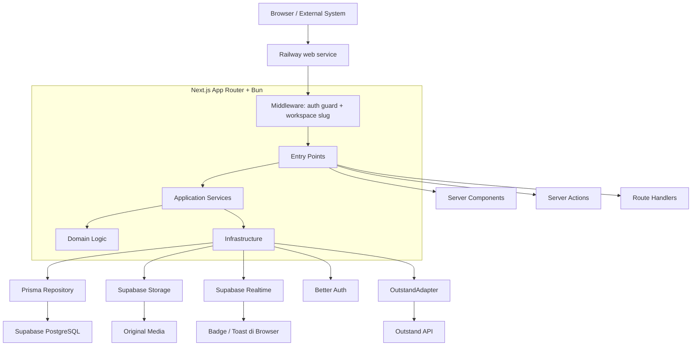

### Batas Tanggung Jawab Layer

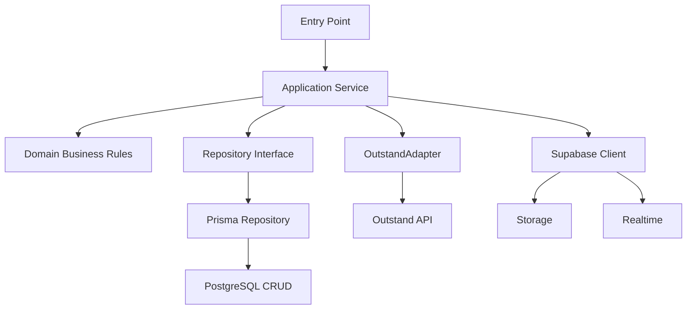

### Flow 1 — Membuka Halaman

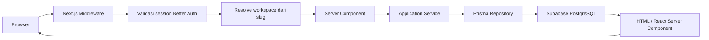

Business logic dan query database tidak diletakkan langsung di page atau layout.

### Flow 2 — Mutation dari UI

Contoh: membuat draft, menjadwalkan post, membalas komentar, atau mengubah
workspace.

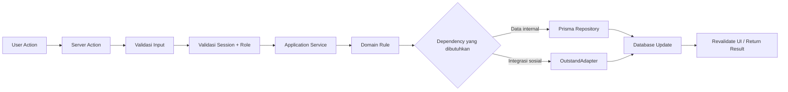

Server Action diperlakukan seperti public endpoint: authentication dan
authorization tetap diperiksa di dalam use-case.

### Flow 3 — Upload Media dan Publishing

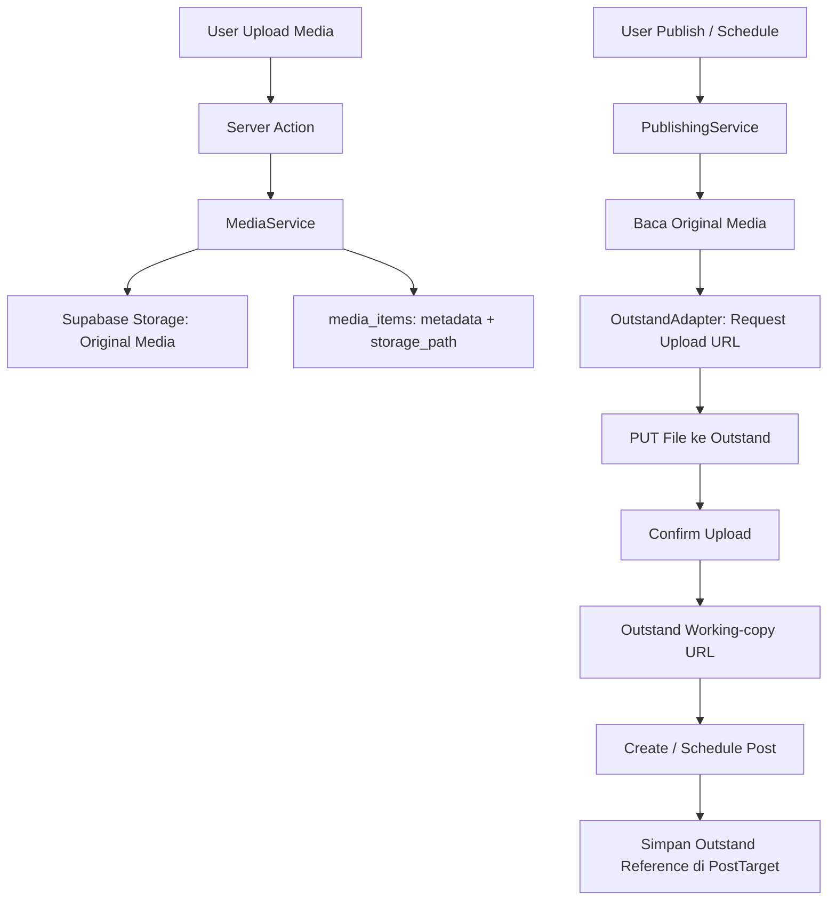

Supabase Storage tetap menjadi tempat original media. Working copy Outstand
bersifat operasional dan dapat kedaluwarsa.

### Flow 4 — Webhook Outstand

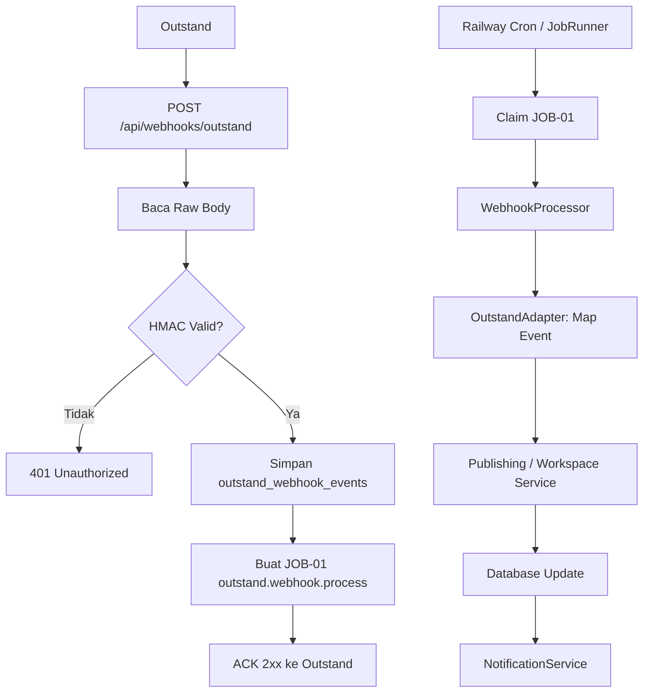

Event webhook MVP:

- `post.published`;
- `post.error`; dan
- `account.token_expired`.

Receipt harus tersimpan sebelum `2xx` dikirim agar event tidak hilang jika
pemrosesan internal gagal.

### Flow 5 — Background Jobs

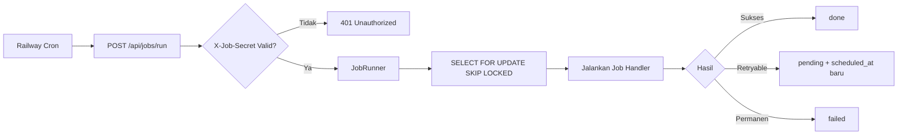

Job utama:

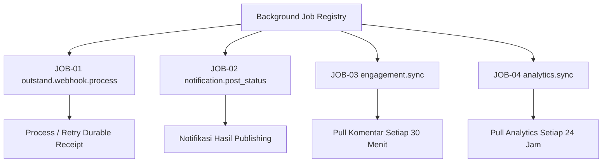

Railway Cron tidak menerbitkan post. Scheduling, delivery, platform rate limit,
dan retry publishing tetap ditangani Outstand.

### Flow 6 — Engagement Comment/Reply

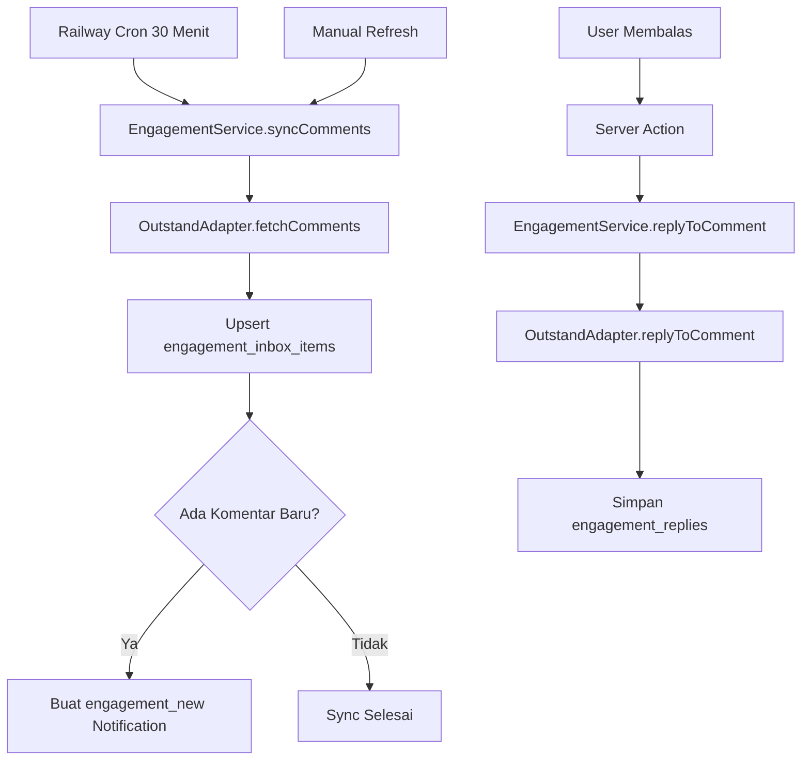

Engagement MVP hanya komentar dan reply. Direct Message, mention, dan webhook
engagement tidak termasuk MVP.

### Flow 7 — Notifikasi Realtime

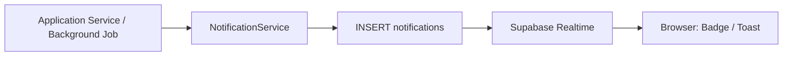

Supabase Realtime hanya menjadi saluran database-ke-browser. Calendar,
Engagement list, dan Analytics tetap diperbarui melalui refresh atau data
fetching biasa.

### Flow 8 — Authentication dan Workspace

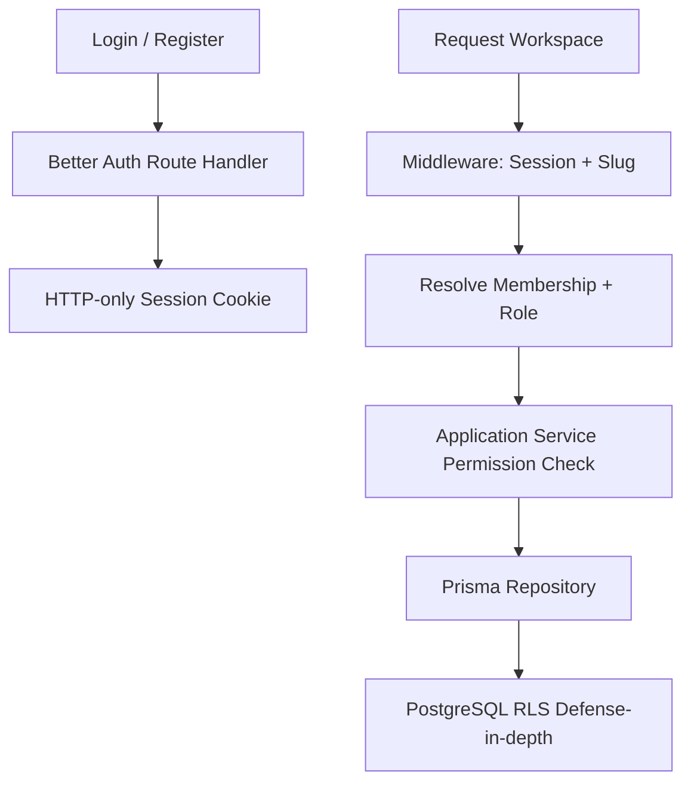

### Flow 9 — Deployment dan Release

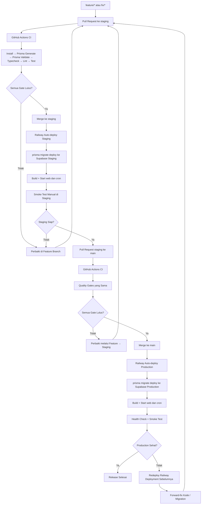

Pembagian tanggung jawab:

- **GitHub Actions** hanya menjalankan quality gates dan tidak melakukan deploy;
- **Railway** melakukan build, migration, start service, dan auto-deploy setelah
  perubahan masuk ke branch environment;
- branch `staging` dipetakan ke Railway + Supabase staging;
- branch `main` dipetakan ke Railway + Supabase production;
- migration production tidak dijalankan dari Pull Request;
- preview deployment per Pull Request tidak digunakan pada MVP; dan
- migration breaking harus memakai pola expand-and-contract agar rollback
  aplikasi tetap aman.

### Ringkasan Akhir

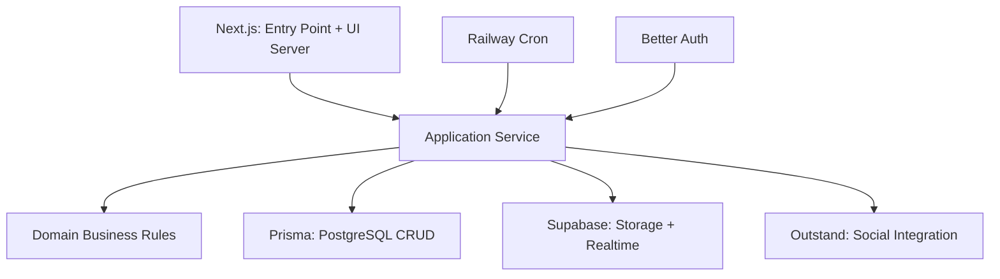

Status: **selaras dengan ADR-040 dan baseline terbaru; implementasi runtime
detail tetap mengikuti task M8 di PROJECT_STATE.md**.

---

## 8. Backend untuk Mobile Client dan Keamanan Bearer Auth

> **Status keputusan (2026-07-24): Selesai — ADR-043.** Project Owner
> menyetujui Route Handler `/api/v1` sebagai API mobile-ready di atas
> Application Service yang sama dengan web, dan Better Auth Bearer plugin
> sebagai mekanisme auth mobile. Keputusan dipindahkan ke ADR-043; update
> baseline `application-layer.md` dan `auth-strategy.md` sudah dikerjakan.

### Pertanyaan

1. "Untuk BE saya sih inginnya dapat digunakan juga untuk Mobile, bagaimana
   menurutmu?"
2. "Kalau dari sisi keamanannya gimana — apakah route API dan auth kita
   (baik untuk web maupun mobile) sudah cukup aman?"

### Konteks Baseline Sebelum Diskusi

Mobile app sudah tercatat di `product-discovery/02-product/future-roadmap.md`
(section "Mobile Experience") dan eksplisit **di luar scope MVP**
(`mvp-definition.md`, `product-scope.md`). Belum ada arsitektur teknis untuk
itu — baseline hanya mendefinisikan Next.js App Router (Server Component,
Server Action, Route Handler, Middleware) sebagai satu-satunya Entry Point
(`application-layer.md`, AL-D01–AL-D04), tanpa pernah membahas reusability-nya
untuk client selain web.

### Kenapa Server Actions Tidak Bisa Dipakai Mobile

Server Actions adalah mekanisme RPC internal Next.js — ID action berubah
setiap build/deploy dan tidak didesain untuk dipanggil dari luar aplikasi
Next.js. Mobile app **wajib** lewat Route Handler (kontrak REST/JSON stabil),
bukan Server Action.

### Kenapa Tidak Perlu BE Terpisah (Hono, dll.)

Karena `application-layer.md` (AL-D02) sudah mewajibkan seluruh business logic
berada di Application Service, bukan di Entry Point, menambah Route Handler
untuk mobile **tidak memerlukan penulisan ulang domain logic** — cukup entry
point tipis baru yang memanggil Application Service yang sama persis dipakai
Server Actions untuk web (`PublishingService`, `WorkspaceService`,
`EngagementService`, dst).

### Rekomendasi Arsitektur

```text
Struktur endpoint : apps/web/app/api/v1/... (Route Handler, versioned)
Prioritas domain  : WorkspaceService (fondasi context) → PublishingService
                    → EngagementService → NotificationService
                    (mengikuti roadmap "Mobile Publishing, Mobile Inbox")
Auth mobile       : Better Auth Bearer plugin — Authorization: Bearer <token>
                    menggantikan cookie session; token disimpan di
                    Keychain (iOS) / Keystore (Android)
Workspace context : eksplisit di path/header tiap request (bukan cookie
                    "active workspace" seperti web)
Versioning        : /api/v1 sekarang; breaking change wajib /api/v2, tidak
                    boleh mengubah kontrak v1 yang sudah dipakai mobile
CORS              : tidak diperlukan untuk native app + Bearer token (CORS
                    mekanisme browser); direvisit jika ada public API
                    berbasis browser/pihak ketiga di masa depan
Timing            : bukan MVP sekarang, tapi fondasi (skema /api/v1, Bearer
                    plugin) disiapkan sebelum M8 development berjalan jauh
```

### Assessment Keamanan Bearer Token untuk Mobile

**Kesimpulan: aman untuk dikunci** — pola standar industri untuk mobile OAuth
client — dengan syarat 4 hal berikut masuk sebagai requirement eksplisit,
bukan diasumsikan otomatis:

1. **Penyimpanan token di device** — wajib Keychain/Keystore/EncryptedSharedPreferences,
   bukan storage polos tanpa enkripsi.
2. **`trustedOrigins` untuk custom scheme mobile** — perlu didaftarkan
   eksplisit (mis. `exp://192.168.*.*:*/*` untuk Expo), bukan wildcard
   sembarangan.
3. **Session expiry untuk mobile** — perlu diputuskan apakah tetap 7 hari
   (AS-D02 existing) atau lebih pendek + refresh mechanism, karena device
   fisik bisa dicuri.
4. **Rate limiting per-endpoint** — Better Auth mendukung `customRules` per
   endpoint (mis. sign-in 5 request/menit), bukan cuma default umum — dipakai
   untuk memperketat endpoint auth yang sekarang jadi lebih exposed via
   `/api/v1`.

**Keuntungan dibanding cookie session:**

- Tidak ada risiko CSRF (Bearer token tidak auto-attached seperti cookie).
- Tetap revocable karena database session (AS-D02 existing) dipertahankan,
  bukan diganti JWT stateless.
- `databaseHooks.session.create/delete` Better Auth bisa dipakai untuk audit
  log auth events (device/IP saat sesi dibuat/dicabut) — menutup sebagian gap
  "audit log = Post-MVP" yang pernah dibahas di section keamanan sebelumnya.

**Gap yang tetap terbuka, di luar kendali baseline backend:**

- Device/session management UI ("lihat & cabut sesi lain") — perlu masuk
  scope produk, bukan cuma backend.
- Certificate pinning — opsional, pertimbangan hardening pasca-MVP.
- Workspace-scoping per request tetap mengandalkan disiplin existing
  (AL-D02/ADR-024) — tidak menambah risiko baru, tapi jadi lebih kritis
  karena request sekarang datang dari client yang tidak kita kontrol UI-nya.

### Dampak terhadap Baseline

- `application-layer.md` — tambah pola "Route Handler v1 untuk mobile client"
  di samping pola existing (webhook eksternal); Decision Log AL-D08.
- `auth-strategy.md` — tambah Bearer plugin sebagai mekanisme auth mobile,
  rate limit `customRules`, `trustedOrigins` custom scheme; Decision Log
  AS-D06; update tabel Security Considerations.
- `auth-architecture.md` — perjelas baris Post-MVP "API key untuk
  programmatic access" (beda dari Bearer user-login mobile); Decision Log
  AU-D11.
- `project-manager/DECISIONS.md` — ADR-043.
- `PROJECT_STATE.md` — Recent Decisions.

### Kesimpulan Final

```text
Tidak ada BE terpisah (Hono, dll.)
Route Handler /api/v1 di atas Application Service yang sama dengan web
Better Auth Bearer plugin untuk auth mobile
Workspace context eksplisit per request (path/header)
4 syarat keamanan wajib: secure device storage, trustedOrigins custom
scheme, keputusan session expiry mobile, rate limit customRules per endpoint
```

Status diskusi: **selesai — dipindahkan ke ADR-043 dan baseline terkait;
implementasi runtime endpoint `/api/v1` tetap task M8, dijadwalkan setelah
MVP web selesai.**
