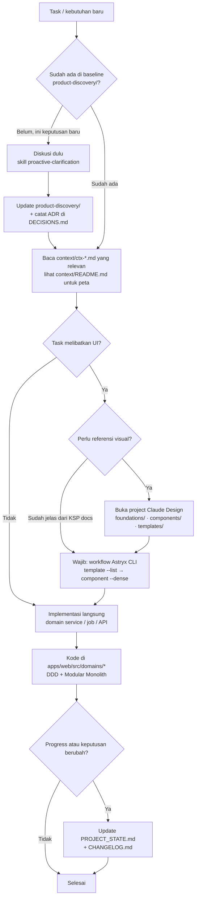
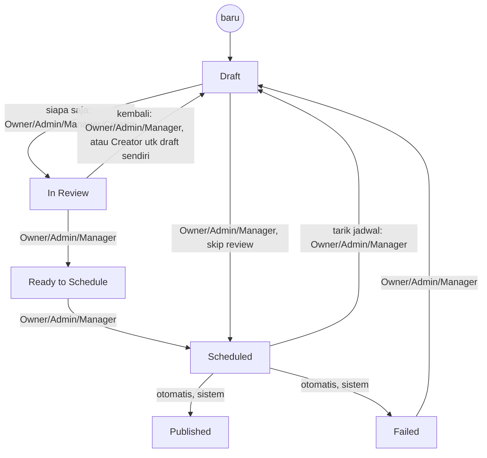

# Developer Workflow

Catatan untuk developer (manusia maupun AI agent) yang bekerja di repo ini —
menjawab "bagaimana kerja di project ini berjalan?" dalam bentuk diagram.

**Ini bukan Source of Truth.** Diagram di sini adalah **visualisasi** dari
proses dan flow yang sudah didefinisikan di dokumen lain. Kalau ada
perbedaan antara diagram di sini dan dokumen aslinya, **dokumen asli yang
menang** — update dokumen aslinya dulu, lalu sinkronkan diagram ini.

Pintu masuk penuh tetap `../AGENTS.md`. Dokumen ini melengkapi, bukan
menggantikan.

---

## 1. Alur kerja project — dari kebutuhan sampai kode

Bagaimana sebuah task (fitur, bug, keputusan) bergerak dari percakapan
sampai menjadi kode yang jalan di `apps/web`.

**Rujukan:** `../AGENTS.md` (aturan keras + mapping task→baca),
`context/README.md`, `../product-discovery/06-engineering/design-tokens.md`
(ADR-042 — Claude Design), `.agents/skills/`.

---

## 2. Alur pengguna — dari buka aplikasi sampai konten terjadwal

End-to-end: auth → workspace → connect account → publish. Ini gabungan dari
`auth-architecture.md` (session & workspace resolution), UF-05 (Connect
Account), dan UF-01 (Create & Schedule Content) di
`product-discovery/04-ux/user-flows.md` — bukan flow baru.

```mermaid
flowchart TD
  A[User membuka aplikasi] --> B{Ada session aktif?<br/>cookie better-auth.session_token}

  B -->|Tidak| C[Sign up / Sign in<br/>email-password atau Google OAuth]
  C --> C2[Session cookie dibuat<br/>HTTP-only, 7 hari]
  B -->|Ya| D{Middleware: workspaceSlug<br/>valid di URL?}
  C2 --> D

  D -->|Belum punya workspace| E[Onboarding: buat workspace pertama<br/>user otomatis jadi Owner]
  D -->|Sudah, role di-resolve| F[Masuk workspace aktif<br/>x-workspace-id + x-workspace-role]
  E --> F

  F --> G{Ada akun sosial<br/>terhubung? UF-05}
  G -->|Belum| H[Workspace Settings →<br/>Connected Accounts]
  G -->|Sudah| M[Publish → Drafts → New Post]

  H --> I[+ Connect Account → pilih platform<br/>IG · FB · X · LinkedIn · TikTok<br/>YouTube · Threads · Pinterest]
  I --> J[OAuth di platform pihak ketiga]
  J --> K{OAuth sukses?}

  K -->|Ya| K2[Akun muncul, status Active]
  K -->|Tidak / batal| H

  K2 --> M
  M --> N[Tulis caption<br/>manual atau AI Assist inline opsional]
  N --> O[Lampirkan media<br/>file lokal atau Media Library]
  O --> P[Account Selector<br/>pilih satu atau beberapa akun tujuan]
  P --> P2[Content Format per akun — ADR-039<br/>IG/FB: Post · Reel · Story<br/>Pinterest: Pin · lainnya: Post]
  P2 --> Q{Siap dijadwalkan?}

  Q -->|Belum| R[Save as Draft]
  Q -->|Ya| S[Schedule Picker → Confirmation Summary<br/>→ Schedule]

  R --> T[Status: Draft<br/>tampil di Publish → Drafts]
  S --> U[Status: Scheduled<br/>tampil di Calendar & Queue]
```

**Rujukan:** `../product-discovery/05-architecture/auth-architecture.md`,
`../product-discovery/04-ux/user-flows.md` (UF-01, UF-05),
`../product-discovery/04-ux/key-screen-patterns.md` (KSP-05), ADR-039.

Engagement (UF-04) dan Analytics (UF-06) tidak digambar di sini — keduanya
adalah siklus terpisah setelah konten published, lihat langsung
`user-flows.md`.

---

## 3. Siklus status konten (state per role)

Enam status kanonikal dan siapa yang boleh memicu tiap transisi — dari
`product-discovery/02-product/roles-permissions.md`. `Creator` sengaja tidak
punya jalur ke `Scheduled` sama sekali (UXP-06: koordinasi ringan, bukan
approval berlapis).

**Catatan:** `Creator` **tidak pernah** bisa memicu transisi ke `Scheduled`
langsung maupun tidak langsung — hanya sampai `In Review`. Post yang sudah
`Scheduled` **tidak** otomatis batal saat akun disconnect (KSP-D09) — tetap
menunggu di antrean sampai akun reconnect.

**Rujukan:** `../product-discovery/02-product/roles-permissions.md`,
`../product-discovery/04-ux/key-screen-patterns.md` (KSP-D09).

---

## Related Documents

* `../AGENTS.md` — pintu masuk agent, aturan keras
* `../context/README.md` — indeks AI Context per domain
* `PROJECT_STATE.md` — status & next task saat ini
* `DECISIONS.md` — seluruh ADR
* `../product-discovery/04-ux/user-flows.md` — flow lengkap (UF-01 s/d UF-06)
* `../product-discovery/02-product/roles-permissions.md` — roles & content status
* `../product-discovery/05-architecture/auth-architecture.md` — auth & session detail
* `../design/README.md` — pointer Claude Design project
